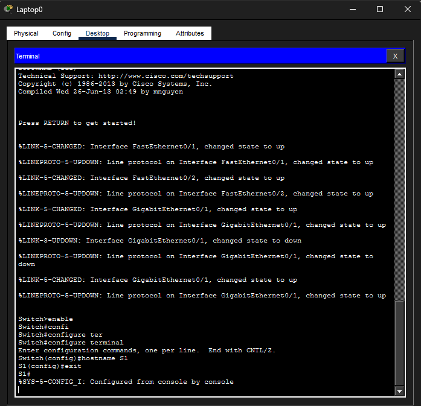
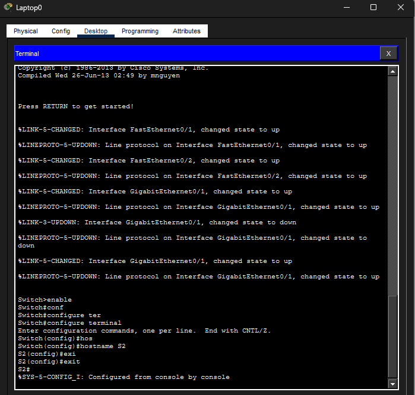
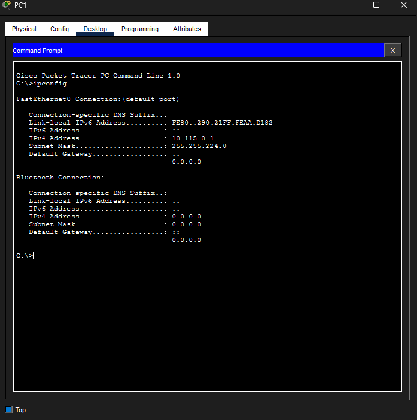
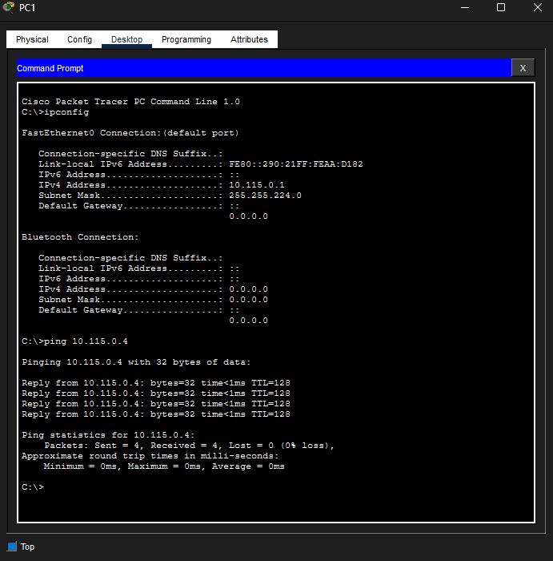

# 3ITE POS - PCK - Switch

## Konfigurace LAN v Cisco Packet Tracer

### Výpočet X 
**_(Příjmení: Doktor)_** D = 68 |o = 111 |k = 107 |t = 116 |o = 111 |r = **_114_**
**_Součet:_** 68 + 111 + 107 + 116 + 111 + 114 = 627 modulo 256 = **_115_**

### Výpočet Y
**_(Jméno: Nicolas)_** N = 78 |i = 105 |c = 99 |o = 111 |l = 108 |a = 97 |s = **_115_**
**_Součet:_** 78 + 105 + 99 + 111 + 108 + 97 + 115 = 713 = 713 modulo 10 = **_3_**

### *_rozsah: 10.115.0.0 / 19_*

---

### 1. Laptop - nastavování switche

---

### 2. PC1 - ipconfig

### 3. PC1 - ping na PC4

